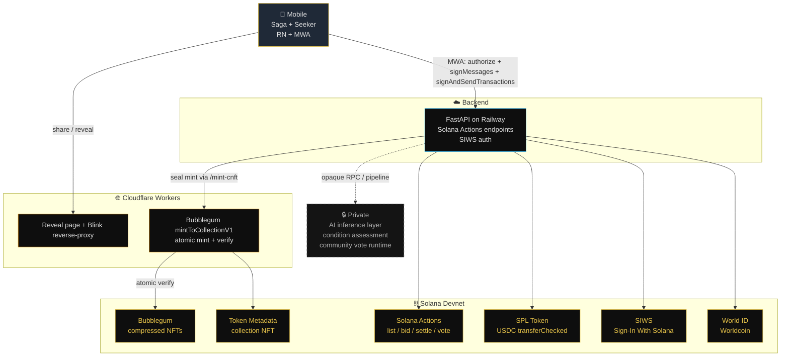

# Architecture

PROOF by Frame is a hybrid app: native Android (React Native + MWA) on the client, FastAPI backend, two Cloudflare Workers at the edge, and Bubblegum on Solana for the proof artifact.




---

## Submission flow (high level)

```text
1. mobile capture (Saga/Seeker) → upload front+back to backend
2. backend stages images, runs OCR + condition assessment async
3. Discord thread created → community votes
4. /seal trigger → backend invokes the cNFT mint Worker
5. Worker calls Bubblegum mintToCollectionV1 (atomic mint+verify)
6. cNFT lands in user wallet with grouping[] populated
7. user shares → friend opens reveal page → buys via Solana Actions/Blinks
```

Detailed implementation (capture pipeline, OCR cascade design, wallet sign paths, Bubblegum integration, polyfill cluster) is held privately. Each stubbed component's behavior is verifiable end-to-end via the live deployment.

---

## Threat model (devnet posture)

| Risk | Mitigation |
|---|---|
| Buyer pays USDC, seller never settles cNFT | Disclosed in bid action description + reveal page banner. Mainnet plan: Squads V4 escrow vault. |
| Network-retry double-bid | 60s idempotency window keyed on (buyer, submission, units) on `POST /api/actions/marketplace/bid`. |
| MWA wallet doesn't support `signMessages` | Fallback `wallet-verify-tx` path uses required `signAndSendTransactions` instead. |
| OCR worker returns gibberish | Backend filter drops obvious failures before persistence; cascade falls through to next slot. |
| User submits photo of nothing | Backend Laplacian-variance + std-dev gate rejects with 422 before staging. |
| Unverified collection on cNFT | Atomic mint+verify via `mintToCollectionV1` ensures `grouping[]` is populated. |

---

## Out of scope for this public repo

To protect first-submission IP:

- Discord bot runtime (control-plane orchestration)
- Premium-tier research pipeline (mechanism + sources)
- Specific OCR worker implementations + prompt engineering
- Deployment runbooks, infrastructure topology, secret-storage configuration
- Operator-private docs (handoffs, status, debugging history)

The contracts at every layer are documented in the per-directory READMEs. Live behavior is verifiable against the on-chain anchors and the deployed endpoints listed in [`README.md`](./README.md).
