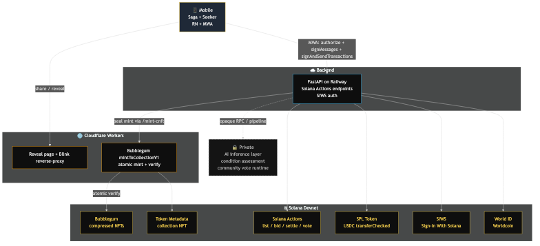

# PROOF by Frame

> ## Community consensus. Before the slab.

Community-graded trading cards on Solana. Submit a card → community votes → seal a verified compressed-NFT (cNFT) with on-chain provenance + condition record. Built for [Solana Frontier 2026](https://colosseum.com/frontier) (devnet).



---

## What it does

The slab — that hard plastic case with a number on it — is the trust signal collectors actually pay for. Today, only PSA / BGS / CGC / TAG can produce one, weeks of turnaround and gatekept fees per card. PROOF inverts the pipeline: the *consensus* arrives **before** the slab, mediated by a community of collectors who vote on what they see, on-chain. The result is a sealed compressed-NFT that travels with the card — provenance, condition signals, and consensus, captured at the moment the community agrees.

A user captures front + back of a card on any Android with a Solana wallet (Saga and Seeker are our reference devices but not required), the backend extracts identity + condition signals, and the submission goes to a Discord-thread vote. Once the community ratifies, the proof is **sealed** — minted as a Bubblegum compressed NFT atomically verified under the `PROOF Sealed Cards` collection. Buyers and sellers transact directly in USDC via Solana Actions / Blinks; PROOF takes zero of the sale.

---

## Solana primitives used

| Primitive | Where |
|---|---|
| **Mobile Wallet Adapter (MWA)** | Mobile app — Saga / Seeker connect, signMessages (SIWS), signAndSendTransactions |
| **Sign-In With Solana (SIWS)** | Backend `/api/auth/wallet-nonce` emits a [Phantom-spec SIWS body](https://github.com/phantom/sign-in-with-solana); `/wallet-verify` ed25519-verifies |
| **Solana Actions / Dialect Blinks** | Backend `/api/actions/*` — list / bid / settle / vote / onboard. Spec headers `x-action-version: 2.4` + `x-blockchain-ids: solana:devnet` |
| **Bubblegum compressed NFTs** | Atomic mint+verify via `mintToCollectionV1` so DAS API returns `grouping[]` populated → wallets render the verified collection badge |
| **SPL Token-2022 + USDC** | Bid action: `transferChecked` + idempotent ATA create + memo, single buyer-signed VersionedTransaction |
| **Solana Pay Transaction Request URL** | `solana:<HTTPS URL>` QR on the reveal page |
| **World ID (Worldcoin)** | OIDC + IDKit zk-proof; nullifier uniqueness gates listing + voting |

---

## Tester install (Android)

The current build runs on **devnet only** and is signed with an Android SDK debug keystore. Production release-keystore swap is mainnet-prep work, out of scope for this build.

1. Download the latest APK from [Releases](../../releases).
2. `adb install -r ProofAPK_<timestamp>_combined.apk` (or sideload via the device's file manager).
3. Open the app → tap **Connect Wallet** → choose Phantom or Solflare in the MWA picker.
4. Switch your wallet to **Devnet** before signing (Phantom: Settings → Developer Settings → Testnet Mode → Devnet).
5. Fund with devnet SOL: https://faucet.solana.com.
6. (Optional, for the buy flow) fund with devnet USDC: https://faucet.circle.com.

Reference devices: **Solana Saga** + **Solana Seeker**. Other Android 11+ devices with MWA-capable wallets should work too.

---

## Live devnet anchors (verifiable without source)

| Anchor | Pubkey / URL |
|---|---|
| PROOF Collection NFT (`PROOF Sealed Cards`) | `7jS864WTvSMce75Y5YUhkbE4K9an9jdCWVWAJVMoaUr5` |
| Bubblegum Merkle Tree (14-depth) | `7z59tiH4vo5Uw1sV1b6MTR47VPraDxMtkzuB1PZ2xqfv` |
| USDC Devnet (Circle) | `4zMMC9srt5Ri5X14GAgXhaHii3GnPAEERYPJgZJDncDU` |
| Backend API | https://frame-brain-production.up.railway.app |
| Reveal page | `https://proofbyframe.com/reveal/<submission_id>` |
| `actions.json` discovery | https://proofbyframe.com/actions.json |

Verify any sealed cNFT's collection via Helius DAS:

```bash
curl -s "https://devnet.helius-rpc.com/?api-key=<YOUR_HELIUS_KEY>" \
  -X POST -H "Content-Type: application/json" \
  -d '{"jsonrpc":"2.0","id":"1","method":"getAsset","params":{"id":"<asset_id>"}}' \
  | jq '.result.grouping'
# → [{"group_key":"collection","group_value":"7jS864WT…"}]
```

---

## Repo layout

```text
proof-by-frame/
├── backend/
│   ├── app/              Solana primitive helpers — Actions URL/memo specs, Helius RPC,
│   │                     state machine, cNFT transfer pattern (full pipeline private)
│   └── scripts/admin/    On-chain bootstrap (contract-only stubs)
├── mobile/               React Native + MWA — capture, review, share, sealed-result view
├── workers/
│   ├── applinks/         CF Worker — /reveal/<id> + /blinkitem reverse-proxy (contract-only)
│   └── cnft-mint/        CF Worker — Bubblegum atomic mint+verify (contract-only)
├── ARCHITECTURE.md       System design + inline Mermaid diagram
├── ARCHITECTURE.png      Pre-rendered diagram (also embedded in .md)
├── LICENSE               MIT
└── .gitignore
```

---

## What's in this public release

A representative open-source slice for [Solana Frontier 8(e)](https://colosseum.com/frontier) review:

- **Open — Solana hot paths (judges can read the implementation)**:
  - `workers/cnft-mint/worker.js` — full Bubblegum `mintToCollectionV1` worker. Atomic mint + verify under the `PROOF Sealed Cards` collection so DAS returns populated `grouping[]`.
  - `mobile/src/services/wallet.ts` — full MWA wallet service. Connect / SIWS `signMessageRaw` / multi-variant `signAndSendTransactions` handling Phantom 26.6.0 quirks.
  - `backend/app/marketplace_actions.py` — Solana Actions URL/memo spec (`x-action-version 2.4`, `x-blockchain-ids: solana:devnet`), USDC unit math, listing memo builder.
  - `backend/app/helius.py` — Helius DAS + RPC wrapper (getAsset, getAssetsByOwner, transaction parsing).
  - `backend/app/cnft_transfer.py` — Bubblegum transfer-instruction builder.
  - `backend/app/constants.py` — submission state machine.
  - `mobile/src/services/solanaPay.ts` — Solana Pay Transaction Request URL builder.
  - Full mobile UI source (screens, hooks, services).
- **Contract-only stubs**: the social-share reveal Worker (`workers/applinks/worker.js`) and the on-chain bootstrap scripts (`backend/scripts/admin/*.mjs`) — bodies documented but redacted. Each stubbed component's behavior is verifiable via the live deployment + on-chain anchors above.
- **Held privately**: FastAPI route handlers + DB schema, Discord bot runtime, AI assessment + condition pipeline, premium-tier research pipeline, deployment runbook, infrastructure topology, secret-storage configuration, and operator-private docs.

This is a deliberate split between *the Solana surface judges verify* (visible: on-chain primitives, Action specs, mobile MWA flows) and *the proprietary product layer* (verifiable end-to-end against the live deployment, but not handed over). A reasonable Solana developer could rebuild any single primitive from public Metaplex / Solana Actions / Phantom docs in 1-3 days. The moat is the integration, the community, and the operational layer — none of which a public source disclosure would compromise.

---

## License

[MIT](./LICENSE).

## Disclaimer

PROOF by Frame is a **community-driven on-chain provenance and condition record**. It is **NOT** an official grade from PSA, BGS, CGC, TAG, or any other certified grading service. The marketplace runs without escrow — buyers and sellers transact directly in USDC; PROOF does not hold funds, does not enforce settlement, and does not handle physical card shipping. **Devnet only.**
